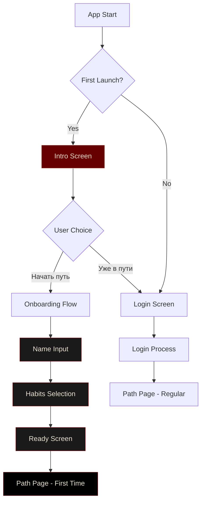

# 🎬 PRIME Forge - Система первого входа

## 📊 Flowchart - Поток экранов



## 🎯 Детальное описание экранов

### 🔹 Экран 1 - Intro (`/intro`)

#### Визуал:
- **Фон**: Чистый черный `#000000`
- **Центр**: Логотип PRIME Forge
  - Шрифт: PRIME Slab One, 32px
  - Цвет: `#E9E1D1` 
  - Анимация: fade + scale (300ms)
  - Эффект: одноразовое бордовое свечение

#### Кнопки:
1. **"Начать путь"**
   - Тип: Primary Button
   - Градиент: `#660000` → `#990000`
   - Текст: `#E9E1D1`, 16px, medium
   - Анимация: slide-in снизу + легкий bounce

2. **"Уже в пути"**
   - Тип: Secondary Button  
   - Фон: прозрачный
   - Обводка: 1px solid `#660000`
   - Текст: `#660000`, 16px, medium

#### Логика:
- При первом запуске показывается автоматически
- "Начать путь" → переход к Name Input
- "Уже в пути" → переход к Login Screen

### 🔹 Экран 2 - Name Input (`/onboarding/name`)

#### Визуал:
- **Фон**: Черный `#000000`
- **Прогресс**: 1/4 (точки внизу)
- **Заголовок**: "Имя"
  - Шрифт: PRIME Slab One, 24px
  - Цвет: `#E9E1D1`

#### Поле ввода:
- **Стиль**: Минималистичное
- **Фон**: `#1A1A1A`
- **Обводка**: 1px solid `#333333`
- **Focus**: 2px solid `#660000`
- **Placeholder**: "Имя героя"
- **Цвет текста**: `#E9E1D1`

#### Валидация:
- Минимум 1 символ
- Максимум 20 символов
- Кириллица и латиница

### 🔹 Экран 3 - Habits Selection (`/onboarding/habits`)

#### Визуал:
- **Фон**: Черный `#000000`  
- **Прогресс**: 2/4
- **Заголовок**: "Выбери старт"

#### Карточки привычек:
```
🌅 Ранний подъём    📚 Чтение
🏋️‍♂️ Тренировка      🧘 Медитация
```

#### Стиль карточек:
- **Размер**: 160x120px
- **Фон**: `#1A1A1A` (неактивная), `#660000` (выбранная)
- **Обводка**: 1px solid `#333333`
- **Радиус**: 8px
- **Иконка**: 32x32px, `#E9E1D1`
- **Текст**: System, 14px, `#E9E1D1`

#### Логика:
- Multi-select (можно выбрать 2-4 привычки)
- Минимум 1 привычка для продолжения
- Анимация при выборе: scale + glow

### 🔹 Экран 4 - Ready (`/onboarding/ready`)

#### Визуал:
- **Фон**: Черный `#000000`
- **Прогресс**: 3/4  
- **Заголовок**: "Готов?"
  - Шрифт: PRIME Slab One, 32px
  - Цвет: `#E9E1D1`
  - Позиция: центр экрана

#### Кнопка:
- **Текст**: "Начать путь"
- **Тип**: Primary Button (большая)
- **Размер**: width: 200px, height: 56px
- **Эффект при нажатии**: fade → bounce → переход

### 🔹 Экран 5 - Path Page (First Time)

#### Особенности первого входа:
- **Приветствие**: "Добро пожаловать, [Имя]!"
- **Аватар**: Силуэт по умолчанию
- **XP/RESPECT**: 0 (с анимацией появления)
- **Привычки**: Выбранные на онбординге как "квесты дня"
- **Подсказка**: "Сделай первый шаг" (toast notification)

## 🎨 Анимации и эффекты

### Типы анимаций:
1. **Fade In/Out**: `opacity 0→1` (200ms ease-out)
2. **Scale**: `scale 0.8→1.0` (300ms ease-out)  
3. **Slide In**: `translateY 50→0` (300ms ease-out)
4. **Bounce**: `scale 1.0→1.05→1.0` (150ms ease-in-out)
5. **Glow**: `boxShadow 0→blur(20px) #660000` (300ms)

### Последовательности:
- **Логотип**: fade + scale одновременно
- **Кнопки**: slide-in с задержкой 100ms
- **Карточки**: staggered animation (по 50ms)
- **Переходы**: fade-out (200ms) → новый экран fade-in (200ms)

## 🛠️ Технические детали

### Зависимости:
```yaml
dependencies:
  shared_preferences: ^2.2.2  # для сохранения данных
  animations: ^2.0.7          # для кастомных анимаций
```

### Структура файлов:
```
lib/features/onboarding/
├── pages/
│   ├── intro_page.dart
│   ├── name_page.dart  
│   ├── habits_selection_page.dart
│   └── ready_page.dart
├── widgets/
│   ├── logo_with_glow.dart
│   ├── habit_card.dart
│   ├── progress_dots.dart
│   ├── onboarding_button.dart
│   └── hero_name_input.dart
├── models/
│   ├── onboarding_data.dart
│   └── habit_model.dart
└── controllers/
    └── onboarding_controller.dart
```

### Модели данных:
```dart
class OnboardingData {
  String? heroName;
  List<HabitModel> selectedHabits;
  bool isCompleted;
}

class HabitModel {
  String id;
  String name;
  String icon;
  String description;
}
```

### Сохранение данных:
```dart
class OnboardingStorage {
  static const String keyHeroName = 'hero_name';
  static const String keySelectedHabits = 'selected_habits';
  static const String keyOnboardingCompleted = 'onboarding_completed';
  
  Future<void> saveOnboardingData(OnboardingData data);
  Future<OnboardingData?> loadOnboardingData();
  Future<bool> isOnboardingCompleted();
}
```

## 🔄 Интеграция с существующим кодом

### Обновления роутинга:
```dart
// В router.dart добавить:
GoRoute(
  path: '/intro',
  builder: (context, state) => IntroPage(),
),
GoRoute(
  path: '/onboarding/name',
  builder: (context, state) => NamePage(),
),
// ... остальные маршруты
```

### Изменение начального маршрута:
```dart
// В main.dart:
void main() async {
  WidgetsFlutterBinding.ensureInitialized();
  
  final storage = OnboardingStorage();
  final isFirstLaunch = !(await storage.isOnboardingCompleted());
  
  runApp(PRIMEApp(initialRoute: isFirstLaunch ? '/intro' : '/login'));
}
```

### Интеграция с системой привычек:
```dart
// В habits_page.dart:
void initializeFromOnboarding() async {
  final data = await OnboardingStorage().loadOnboardingData();
  if (data != null) {
    // Создать привычки из выбранных на онбординге
    for (final habit in data.selectedHabits) {
      HabitsController.createHabit(habit);
    }
  }
}
```

## ✅ Чек-лист реализации

### Phase 1 - Базовая структура:
- [ ] Создать модуль onboarding
- [ ] Настроить роутинг
- [ ] Создать базовые страницы
- [ ] Настроить анимации

### Phase 2 - Компоненты:
- [ ] LogoWithGlow виджет
- [ ] HabitCard компонент
- [ ] ProgressDots индикатор
- [ ] Кастомные кнопки

### Phase 3 - Логика:
- [ ] OnboardingController
- [ ] Сохранение/загрузка данных
- [ ] Валидация форм
- [ ] Интеграция с главным приложением

### Phase 4 - Полировка:
- [ ] Тестирование переходов
- [ ] Оптимизация анимаций
- [ ] Адаптивность
- [ ] Accessibility

## 🎪 UX детали

### Микроинтеракции:
- Кнопки имеют hover-эффект (scale 1.05)
- Поля ввода анимируют focus состояние
- Карточки привычек пульсируют при выборе
- Переходы сопровождаются haptic feedback

### Состояния ошибок:
- Пустое имя: поле подсвечивается красным + shake анимация
- Не выбраны привычки: карточки пульсируют оранжевым

### Accessibility:
- Все интерактивные элементы имеют семантические labels
- Поддержка screen readers
- Достаточный контраст цветов
- Размеры touch targets минимум 44x44px

---

**Версия**: 1.0  
**Статус**: Ready for implementation 🚀  
**Дата**: 18.08.2025
